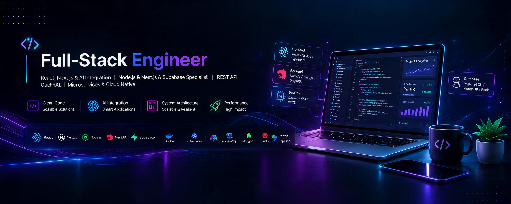

  

  
  
  

  <a href="#-about-me">About</a> •
  <a href="#-impact-areas">Impact Areas</a> •
  <a href="#-tech-universe">Tech Universe</a> •
  <a href="#-live-engineering-dashboard">Dashboard</a> •
  <a href="#-certifications">Certifications</a>

---

## 👨‍💻 About Me

<table>
  <tr>
    <td width="62%" valign="top">
      

       I’m a Full-Stack Engineer focused on building scalable, high-performance web applications with a strong engineering mindset and a keen eye for user experience.
      

      

🔹 Frontend Development:
I build modern, responsive user interfaces using HTML, CSS, TailwindCSS, JavaScript, and TypeScript.
My main stack includes React and Next.js for creating scalable and production-ready applications.
I create advanced UI experiences using GSAP for animations and Three.js (Basic) for 3D and interactive web applications.
      

      

🔹 Backend & Database:
I develop robust and scalable backend services using Node.js and NestJS.
I work with both relational and NoSQL databases, including MongoDB and PostgreSQL (via Supabase).
I’m highly experienced in designing and consuming RESTful APIs and integrating backend services seamlessly into frontend applications.
For real-time functionality, I utilize Socket.IO and Supabase real-time features.
      

      

          🔹 Software Engineering Skills:
I apply core software engineering principles such as design patterns, systems design, clean architecture, clean code, and OOP.
I have a solid understanding of Data Structures and Algorithms (DSA), which helps me write efficient, optimized, and maintainable code.
My focus is not just on building UI, but on engineering scalable, maintainable, and production-ready web applications from end to end.
I’m open to freelance and remote opportunities. Let’s connect and build something great together! 🚀
      

      

        🤝 <strong>Connect with me:</strong> 
        
      

    </td>
    <td width="38%" align="center">
      
    </td>
  </tr>
</table>

## 🧰 Tech Universe

### Languages

  

### Core Stack Front-End

  

### Core Stack Back-End

  

### Tools

  
  
  
  
  
  
  
  
  
  
  
  
  
  
  
  
  
  
  
  
  
  
  
  
  
  
  
  
  
  
  
  
  
  
  
  
  

---

## 📡 Live Engineering Dashboard

  
  

  
  

  

  

---

<!-- ## 🏅 Certifications

  
  
  

 -->